# PJ2实验文档

### —— 18300290055 赵一玲


## √ 对数据库的修改

在数据库的travelimage中增加了FavoredNum的Column，来统计每张照片的收藏个数，并更新原有数据。

在travelimagefavor中增加了path和username（图片的收藏者的username）。

设置travelimge的imageid为自增，增加了country和city（一开始用到），设置path为unique。

## √ 基本功能

### 1、非登陆能访问的页面

#### login &register

首先先做了register，这里主要使用了bootstrapValidator来校验结合jquery使用，进行合法性检验，用户名只能包含大小写英文字母和数字，其余均为非法用户名，同时用户名不能重复注册，然后邮箱需要合法，两次密码应该输入一致，且密码只能包含大写、小写英文字母、数字和下划线，小于8位的为弱密码，这些均会拒绝用户的注册并给出相应的提示，如下：

```js
$(function () {
    $('form').bootstrapValidator({
        message: 'This value is not valid',
        //live: 'enabled', //验证时机，enabled是内容有变化就验证（默认）
        feedbackIcons: {
            valid: 'glyphicon glyphicon-ok',
            invalid: 'glyphicon glyphicon-remove',
            validating: 'glyphicon glyphicon-refresh'
        },
        fields: {
            id: {
                message: '用户名验证失败',
                verbose: false, //代表验证按顺序验证。验证成功才会下一个（验证成功才会发最后一个remote远程验证）
                validators: {
                    notEmpty: {
                        message: '用户名不能为空'
                    },
                    regexp: {
                        regexp: /^[a-zA-Z0-9_]+$/,
                        message: '用户名只能包含大写、小写英文字母、数字'
                    },
                    remote: { //ajax验证。server result:{"valid",true or false} （返回前台类型）
                        //url: "../php/test.php",
                        url:"../php/usernameRegistered.php",
                        //url:'../php/register.php',
                        message: '用户名已存在,请重新输入',
                        delay: 500, //ajax刷新的时间是0.5秒一次
                        type: 'POST',
                        //自定义提交数据，默认值提交当前input value
                         data: function(validator) {
                            return {
                                id: $("input[name=id]").val(),
                            };
                        }

                    }
                }
            },
            email: {
                validators: {
                    notEmpty: {
                        message: '邮箱地址不能为空'
                    },
                    regexp: {
                        regexp: /^([a-zA-Z0-9]+[_|\_|\.]?)*[a-zA-Z0-9]+@([a-zA-Z0-9]+[_|\_|\.]?)*[a-zA-Z0-9]+\.[a-zA-Z]{2,3}$/,
                        message: '邮箱格式错误'
                    }
                }
            },
            password1: {
                message: '密码验证失败',
                validators: {
                    notEmpty: {
                        message: '密码不能为空'
                    },
                    regexp: {
                        regexp: /^[a-zA-Z0-9_]+$/,
                        message: '密码只能包含大写、小写英文字母、数字和下划线'
                    },
                    stringLength: {
                        min: 8,
                        max: 18,
                        message: '弱密码！请保证在8到18位之间'
                    },
                    identical: {
                        field: 'password2',
                        message: '用户新密码与确认密码不一致！请修改！'
                    }
                }
            },
            password2: {
                message: '密码验证失败',
                validators: {
                    notEmpty: {
                        message: '密码不能为空'
                    },
                    regexp: {
                        regexp: /^[a-zA-Z0-9_]+$/,
                        message: '密码只能包含大写、小写英文字母、数字和下划线'
                    },
                    stringLength: {
                        min: 8,
                        max: 18,
                        message: '弱密码！请保证在8到18位之间'
                    },
                    identical: {
                        field: 'password1',
                        message: '密码不一致！'
                       }
                }
            }
        }
    });
```

同时验证中后端写了一个usernameRegistered文件来检查数据库中是否已有该username，同时为了保证密码与确认密码相同且防止验证通过后密码不小心再次修改无法重新验证的情况，将密码保证一定与确认密码相同，所以只有当两次密码均输完且相同时才会允许注册。

然后表单提交到后端php文件，在数据均不为空的情况下将数据插入数据库后，跳转到登录界面。

这里一开始出现了一些问题：一开始同时用了form和ajax 于是发现当我点击submit时会有了两次提交，每次都会多出一条空数据。然后发现自己写的是适合form提交的方法 ，不知道为啥用ajax提交的是空数据？？？序列化的表单数据有问题，把ajax的删掉就成功了！

同时一开始form无法提交，经查阅资料后发现由于用了bootstrapvalidator，因为插件用的是jquery的submit 方法，不能用name="submit" 属性，修改name之后可以正确提交。


之后做了login，因为之前已经有了register的基础，这里验证中首先需要查看是否存在这个用户，后端返回相应的确认valid才能验证通过，同时输入密码之后验证密码与用户名是否匹配，匹配的话才能验证通过。

```js
$(function () {
    $('form').bootstrapValidator({
        message: 'This value is not valid',
        //live: 'enabled', //验证时机，enabled是内容有变化就验证（默认）
        feedbackIcons: {
            valid: 'glyphicon glyphicon-ok',
            invalid: 'glyphicon glyphicon-remove',
            validating: 'glyphicon glyphicon-refresh'
        },
        fields: {
            id: {
                message: '用户名验证失败',
                verbose: false, //代表验证按顺序验证。验证成功才会下一个（验证成功才会发最后一个remote远程验证）
                validators: {
                    notEmpty: {
                        message: '用户名不能为空'
                    },
                    regexp: {
                        regexp: /^[a-zA-Z0-9_]+$/,
                        message: '用户名只能包含大写、小写英文字母、数字'
                    },
                    remote: { //ajax验证。server result:{"valid",true or false} （返回前台类型）
                        //url: "../php/test.php",
                        url:"../php/usernameNotExist.php",
                        //url:'../php/register.php',
                        message: '用户名不存在,请重新输入或前往注册',
                        delay: 500, //ajax刷新的时间是0.5秒一次
                        type: 'POST',
                        //自定义提交数据，默认值提交当前input value
                         data: function(validator) {
                            return {
                                id: $("input[name=id]").val(),
                            };
                        }

                    }
                }
            },

            password: {
                message: '密码验证失败',
                validators: {
                    notEmpty: {
                        message: '密码不能为空'
                    },
                    regexp: {
                        regexp: /^[a-zA-Z0-9_]+$/,
                        message: '密码只能包含大写、小写英文字母、数字和下划线'
                    },
                    stringLength: {
                        min: 8,
                        max: 18,
                        message: '弱密码！请保证在8到18位之间'
                    },

                    remote: { //ajax验证。server result:{"valid",true or false} （返回前台类型）

                        url:"../php/passwordCheck.php",
                        message: '用户密码不一致！请修改！',
                        delay: 500, //ajax刷新的时间是0.5秒一次
                        type: 'POST',
                        //自定义提交数据，默认值提交当前input value
                        data: function(validator) {
                            return {
                                id: $("input[name=id]").val(),
                                password:$("input[name=password]").val()
                            };
                        }

                    }
                }
            }


        }
    });


});
```

提交数据后，后端很方便的实现如下，为了双保险，防止用户验证完再改数据再加一个密码与用户名是否匹配的判断，若匹配，设置session，用户登录：

```php
<?php
$username=$_POST['id'];
session_start();
//由于先前已经通过usernameexist和passwordcheck 这边双保险再加一个判断写session
$pwd=$_POST['password'];
$user = 'root';
$password = 'root';
$db = 'Pj2';
$host = 'localhost';
$port = 3306;
$serve='localhost:3306';


$con = new Mysqli($serve,$user,$password,$db);
$sql="select * from traveluser where username='$_POST[id]' and pass='$_POST[password]'";
$result=$con->query($sql);
//$data=array();

$valid = false;
if(mysqli_num_rows($result)>0)//exists
    $valid=true;


mysqli_close($con);//关闭mysql链接答
if($valid) {
    $_SESSION['username'] = $username;
}
echo " <script   language = 'javascript' type = 'text/javascript' > ";
echo "window.location.href='../index.php'";
echo " </script > ";
?>
```


##### 保存登陆状态时遇到的一些问题

在保存登录状态需要写session时，这里出现了一个很奇怪的问题，我在一个php中写了$_SESSION['username']，但是在另一个php文件中无法读，但是我新开一个test文件试图写，却能够看到？

经过种种尝试发现它所在的<?php ?>必须得是第一个，因为我写的php，以为为了链接mamp在我自己的php代码前加了

```php
<?php
$user = 'root';
$password = 'root';
$db = 'inventory';
$host = 'localhost';
$port = 3306;

$link = mysqli_init();
$success = mysqli_real_connect(
    $link,
    $host,
    $user,
    $password,
    $db,
    $port
);
?>
```

但其实这个好像是mamp给的一个例子，删掉即可，这也是摸索的过程。

#### 接下来的非登录可访问的页面都进行了这样的设置来控制导航栏：

```php
<ul> 
  <!--  <ul id="1">  -->
   
   <li><a href="index.php">Home</a></li>
   <li><a href="browse.php">Browse</a></li>
   <li><a href="search.php">Search</a></li>
<!-- </ul> -->

    <li id="my_account">
        <?php if(isset($_SESSION['username'])) : ?>
            <a href="#">My Account</a>
            <ul>
                <li id="upload"><a href="upload.php"><i class="fa fa-cloud-upload" aria-hidden="true"></i> Upload</a></li>
                <li id="pics"><a href="mypics.php"><i class="fa fa-camera-retro" aria-hidden="true"></i> My Pics</a></li>
                <li id="favor"><a href="myfavor.php"><i class="fa fa-gratipay" aria-hidden="true"></i> My Favorite</a></li>
                <li id="log"><a href="../php/logout.php"><i class="fa fa-sign-in" aria-hidden="true"></i> Log out</a></li>
            </ul>
        <?php else: ?>
            <a href="login.html">Log in</a>

        <?php endif ?>
   </li>
   </ul>   
```


#### detail

在数据库的travelimage中增加了FavoredNum的Column，来统计每张照片的收藏个数，并更新原有数据。

在travelimagefavor中增加了path和username（图片的收藏者的username）。

***一开始我的想法是***，前后端分离，detail是一个html页面，然后数据都通过js来填充，即将图片的超链接url设置为带参数的，然后通过js将根据传的这些参数进行设置数据，先将相关信息设置好之后，在mypics中增加了功能：往数据库的travelimagefavor中查找有没有相关的image--user对，如果有的话往url的最后添加参数favored=true，代表当前用户已收藏该页面，然后对应的detail网页会切换到已收藏状态，同时如果点击未收藏会把travelimagefavor中相应的通过username和path唯一确定的条目删掉，但不删除照片本身，同时后端跳转后不设favored参数，展示的图片为未收藏状态。这里可能会有一点安全问题，但是我尝试着用ajax不知道为啥后端有时get不到数据orzzzzz一会儿有一会儿无……应该是我的问题orz太难了，不过后端相关写操作的文件都是一闪而过马上跳转的，应该也没什么大问题，修改显示的话通过chrome仍可以达到相同效果。同时如果把已收藏的状态favored参数删掉再点再收藏，后端测试查找是否存在，如果已存在就不加，如果把未收藏的状态加成已收藏，那么即对travelimagefavor中删掉一个本就不存在的条目，则显示如下，对数据库的数据无影响。

```
0 rows affected. (Query took 0.0004 seconds.)
DELETE FROM `travelimagefavor` WHERE path='h' and username='s'
```

同时还双保险，在后端先查找travelimagefavor中是否有通过username和path唯一确定的条目，如果有的话，说明是user手动删除了favored则对于setFavored.php而言不做相关操作，跳转自动加上favored，如果无的话，说明是user手动添加了favored则对于cancelFavored而言不做相关操作，跳转不加favored


***但是后来***，通过研究助教给的数据库的数据，感觉还是全部改成通过path来从数据库中获取数据更好。于是将图片的参数只改为path（这里其实应该传递id更合理，但是所有的删除图片和切换收藏的php都已经写好是根据path来看，同时path也在数据库中设置了唯一值所以也不改了，感觉差别不大）。然后把整个detail页面改成php文件，通过path来访问travelimage里面的数据，然后逐一显示，还能get到imageid，favoredNum也直接通过imageid去travelimagefavor中找记录的个数，直接显示，并切换状态，同时由于图片大小不同，长宽高没有限制，于是js动态设置宽度以保证页面不会变形过度，如下，通过判断当前用户是否收藏了这张图片，如果是的话valid为true，不然为false，然后根据valid来判断收藏的状态，如果为收藏，设置按钮href跳转到取消收藏的php，如果未收藏，设置超链接a的href到收藏的php：

```php
<script defer>
    //alert(document.getElementById('con_pic').width+380);
    //alert(document.getElementById('content').style.getPropertyValue('min-width'));

    if(document.getElementById('con_pic').width+380>1200){
        document.getElementById('content').style.setProperty('width',document.getElementById('con_pic').width+380+250+'px');
        document.getElementById('detail').style.setProperty('width',document.getElementById('con_pic').width+380+250+'px');
        document.getElementsByTagName('header')[0].style.setProperty('width',document.getElementById('con_pic').width+380+290+'px');
        document.getElementsByClassName('top')[0].style.setProperty('width',document.getElementById('con_pic').width+380+290+'px');
        document.getElementsByTagName('footer')[0].style.setProperty('width',document.getElementById('con_pic').width+380+290+'px');


    }


    let notlike= document.getElementById('like');
    <?php


    $sql="select * from traveluser where username='$username'";
    $result=$con->query($sql);
    $row=$result->fetch_row();
    $uid=$row[0];

    $sql="select * from travelimagefavor where imageid='$imageid' and uid='$uid'";
    $result=$con->query($sql);
    $valid='false';


    if(mysqli_num_rows($result)>0)
        $valid='true';
    else
        $valid='false';


    ?>

    if(<?php echo $valid; ?>){
        notlike.style.color="red";
        notlike.setAttribute('href','../php/detailCancelFavored.php?path='+'<?php echo $path; ?>');
        notlike.onclick = function () {
            alert('若已登陆马上取消收藏，若未登录跳转到登录界面，请登录后操作...');
        }
    }
    else{
        notlike.style.color="white";
        notlike.setAttribute('href','../php/setFavored.php?path='+'<?php echo $path; ?>');
        notlike.onclick = function () {
            alert('若已登陆马上收藏，若未登录跳转到登录界面，请登录后操作...');
        }
    }

</script>
```

同时对于setFavored.php和detailCancelFavored.php中，均先通过path得到uid和favorednum和imageid，然后收藏favorednum+1，取消收藏favorednum-1，然后更新travelimage中的favorednum，然后对应的，取消收藏把通过imageid和uid找到的travelimagefavor中的记录删除(一开始是用path，但是因为助教原数据没有path之后改了)，添加收藏插入新的记录。

然后设置未登录的用户可以查看detail，但是在点击收藏/取消收藏时（考虑url恶意改写问题）会自动跳转到登录页面。这里用js实现path是否为空。这里有个坑在于判断GET的参数不是判断！=null，而应该是`''`来代表空字符。

基本实现如下：

setFavored.php:

```php
<?php
session_start();
header("Content-type:text/html;charset-utf-8");
header("Access-Control-Allow-Origin: *"); //解决跨域
header('Access-Control-Allow-Methods:POST');// 响应类型


if(!isset($_SESSION['username'])) {
echo 'Please log in first !';

echo "<script>window.location.href='../html/login.html'</script>";
}
else {


    $username = $_SESSION['username'];


    $user = 'root';
    $password = 'root';
    $db = 'Pj2';
    $host = 'localhost';
    $port = 3306;
    $serve = 'localhost:3306';
    $con = new Mysqli($serve, $user, $password, $db);
    $con->query("SET NAMES utf8");//解决中文乱码问题

    $path = $_GET["path"];

    $sql = "select * from travelimage where path='$path'";
    $result = $con->query($sql);
    $row = $result->fetch_row();
    $imageid = $row[0];
    $sql="select * from traveluser where username='$username'";
    $result=$con->query($sql);
    $row=$result->fetch_row();
    $uid=$row[0];

    $sql = "select * from travelimagefavor where imageid='$imageid'and uid='$uid'";
    $result = $con->query($sql);
    $valid;

    if (mysqli_num_rows($result) == 0) {
        $valid = true;
    } else {
        $valid = false;
    }
    $sql = "select * from travelimage where path='$path'";
    $result = $con->query($sql);

    if (mysqli_num_rows($result) > 0) {
        while ($row = $result->fetch_row()) {
            $favoredNum = $row[13];
            if ($valid == true)
                $favoredNum = $row[13] + 1;
            //this is the author's uid not current user $uid=$row[7];
            $imageid = $row[0];
            $title = $row[1];
            $des = $row[2];
            $country = $row[11];
            $city = $row[12];
            $content = $row[10];
            $author = $row[8];


        }
    }

    $sql="select * from traveluser where username='$username'";
    $result=$con->query($sql);
    $row=$result->fetch_row();
    $uid=$row[0];

    if ($path != null && $valid == true) {
        $sql = "UPDATE `travelimage` SET `FavoredNum` = '$favoredNum' WHERE `travelimage`.`path` = '$path'";
        $result = $con->query($sql);
        $sql = "INSERT INTO `travelimagefavor`(`UserName`,`ImageID`,`Path`,`UID`) VALUES ('$username','$imageid','$path','$uid')";
        $result = $con->query($sql);
    }
    echo " <script   language = 'javascript' type = 'text/javascript' > ";

    echo "window.location.href='../html/detail.php?path=";
    echo $path;
//    echo '&title=';
//    echo $title;
//    echo '&description=';
//    echo $des;
//    echo '&country=';
//    echo $country;
//    echo '&city=';
//    echo $city;
//    echo '&content=';
//    echo $content;
//    echo '&author=';
//    echo $author;
//    echo '&favorNum=';
//    echo $favoredNum;
//    echo '&favored=';
//    echo 'true';
    echo '\'';
    echo " </script > ";

    mysqli_free_result($result);
    mysqli_close($con);//关闭mysql链接答
}
```

detailCancelFavored.php:

```php
<?php

header("Content-type:text/html;charset-utf-8");
header("Access-Control-Allow-Origin: *"); //解决跨域
header('Access-Control-Allow-Methods:POST');// 响应类型

//$upload="upload";
session_start();

if(!isset($_SESSION['username'])) {
    echo 'Please log in first !';

    echo "<script>window.location.href='../html/login.html'</script>";
}
else {

    $username = $_SESSION['username'];


    $user = 'root';
    $password = 'root';
    $db = 'Pj2';
    $host = 'localhost';
    $port = 3306;
    $serve = 'localhost:3306';
    $con = new Mysqli($serve, $user, $password, $db);
    $con->query("SET NAMES utf8");//解决中文乱码问题

    $path = $_GET["path"];

    $sql="select * from traveluser where username='$username'";
    $result=$con->query($sql);
    $row=$result->fetch_row();
    $uid=$row[0];

    $sql = "select * from travelimage where path='$path'";
    $result = $con->query($sql);
    $row = $result->fetch_row();
    $imageid = $row[0];

    $sql="select * from travelimagefavor where imageid='$imageid'and uid='$uid'";
    $result=$con->query($sql);
    $valid;

    if (mysqli_num_rows($result) > 0) {
        $valid = true;
    } else {
        $valid = false;
    }

    $sql = "select * from travelimage where path='$path'";
    $result = $con->query($sql);

    if (mysqli_num_rows($result) > 0) {
        while ($row = $result->fetch_row()) {
            $favoredNum = $row[13];
            if ($valid == true)
                $favoredNum = $row[13] - 1;
            //this is the author's uid not current user $uid=$row[7];
            $imageid = $row[0];
            $title = $row[1];
            $des = $row[2];
            $country = $row[11];
            $city = $row[12];
            $content = $row[10];
            $author = $row[8];

        }
    }


    if ($path != null && $valid == true) {
        $sql = "UPDATE `travelimage` SET `FavoredNum` = $favoredNum WHERE `travelimage`.`path` = '$path'";
        $result = $con->query($sql);
        $sql = "DELETE FROM `travelimagefavor` WHERE imageid='$imageid' and uid='$uid'";
        $result = $con->query($sql);
    }

    mysqli_free_result($result);
    mysqli_close($con);//关闭mysql链接答
    echo " <script   language = 'javascript' type = 'text/javascript' > ";

    echo "window.location.href='../html/detail.php?path=";
    echo $path;
//    echo '&title=';
//    echo $title;
//    echo '&description=';
//    echo $des;
//    echo '&country=';
//    echo $country;
//    echo '&city=';
//    echo $city;
//    echo '&content=';
//    echo $content;
//    echo '&author=';
//    echo $author;
//    echo '&favorNum=';
//    echo $favoredNum;

    echo '\'';
    echo " </script > ";


}
```


***同时考虑到index主页刷新随机图片显示的问题，由于助教给的数据中还有path为空的项目……这里加了判断，如果path为空会提示并跳转到首页***

如下是助教数据path为空的例子……我把这条记录删除了

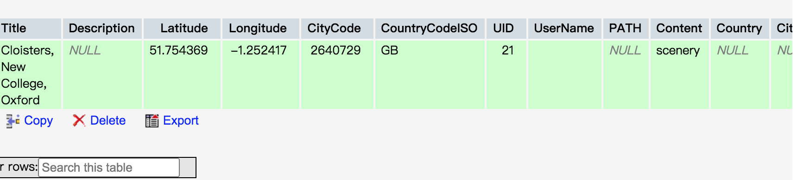


同时在上了最新的web课后，终于了解了助教原始数据中countrycode和citycode的用途，对应在detail中，通过外键的inner join查找到这个path对应的在geocountries表中的countryname，然后通过citycode，再查一次，找到了geocities中对应的AsciiName。

```php
$sql="select geocountries.CountryName,travelimage.CountryCodeISO,travelimage.CityCode,travelimage.PATH from travelimage inner join geocountries on travelimage.`CountryCodeISO`=geocountries.fipsCountryCode where path='$path'";
$result=$con->query($sql);
$row=$result->fetch_row();
$country=$row[0];
$citycode=$row[2];

$sql="SELECT * FROM geocities WHERE `GeoNameID`='$citycode'";
$result=$con->query($sql);
$row=$result->fetch_row();
$city=$row[1];


echo '<tr><td>Country : ';
echo $country;
echo '</td></tr>';
 echo '<tr><td>City : ';
echo $city;
echo '</td></tr>';
```


#### home

由于在数据库的travelimage中增加了FavoredNum的Column，来统计每张照片的收藏个数，所以这里的热门图片直接搜索，且按favoredNum倒序排列，取前8张图，而如果按了刷新按钮的话，会增加fresh参数，从而使得随机选择8张图片显示。同时如果收藏数>0的图片小于8张会按照imageid排列，即imageid小的优先展示。

```php
<a href="index.php?fresh=true" onclick="alert('已刷新')">

</a>
```

```php
        <!-- 热门图片展示 -->
    <?php

    $user = 'root';
    $password = 'root';
    $db = 'Pj2';
    $host = 'localhost';
    $port = 3306;
    $serve='localhost:3306';


    $con = new Mysqli($serve,$user,$password,$db);

if($_GET["fresh"]==true){
    $sql="select * from travelimage order by Rand() limit 0,8";
    //unset($_SESSION['fresh']);
}else {
    $sql = "select * from travelimage order by FavoredNum desc limit 0,8"; //如果收藏数>0的小于8个之后按照imageid递减
}


    $result=$con->query($sql);


    if(mysqli_num_rows($result)>0) {
    while ($row = $result->fetch_row()) {
        echo "<div>";
        echo '<a href="./detail.php?path=';
        echo $row[9];

        echo '">';
        echo '</a>';
        echo '<p class="word1">';
        echo $row[1];
        echo '</p>';
        echo '<p class="word1">';
        echo $row[2];
        echo '</p></div>';

    }
    }


?>
```


#### browse

首先进行单字段标题筛选，支持模糊筛选，即通过找到所有包含所输入连续字符的标题。通过判断对应的筛选方式是否在GET中不为空字符来决定如何查找和展示

```php
<div id="sidesearch">
                <p><i class="fa fa-ravelry" aria-hidden="true"></i> SEARCH BY TITLE</p>
                <form action="" method="GET" name="to_browse">
                <!-- 两个均用name=“to_browse”来命名form -->
                <i class="fa fa-search" aria-hidden="true"></i> <input name="browse_search" type="search" >
                <input name="search" type="submit" value="search" onclick="alert('已搜索')">
                <!-- 解决放到github上之后的405not allowed 问题 -->
                </form>
</div>
```

```php
if($_SERVER["REQUEST_METHOD"] == "GET"&&$_GET['browse_search']!='')
{

    $title = $_GET['browse_search'];

    $sql = "select * from travelimage where title like '%$title%'";
    $result = $con->query($sql);


    $page = empty($_GET['page']) ? 1 : $_GET['page'];
    $pageRes = mysqli_fetch_assoc($result);
    $count = mysqli_num_rows($result);
    //每页显示数 每页显示五条
    $num = 20;
    //根据每页显示数可以求出来总页数
    $pageCount = ceil($count / $num);  //ceil取整
    if($pageCount>5)
        $pageCount=5;
    //根据总页数求出偏移量
    $offset = ($page - 1) * $num; //起始位置


        $sql = "select * from travelimage where title like '%$title%' limit $offset,$num";
        $result = $con->query($sql);


    if (mysqli_num_rows($result) > 0) {

        while ($row = $result->fetch_row()) {
            //while ($row=mysqli_fetch_assoc($res)){

            echo '<a href="./detail.php?path=';
            echo $row[9];

            echo '">';

            echo '';
            echo '</a>';


        }
        echo '<div id="page"> <a href="./browse.php?page=';
        echo ($page-1)>0 ? $page-1:1;
        echo '&browse_search=';
        echo $title;
        echo '" onclick="alert(\'正在跳转前一页\')">&lt&lt&nbsp</a>';
        $i = 1;
        for (; $i <= $pageCount; $i = $i + 1) {
            if ($i == $page) {
                echo '<a style="font-size:40px;color:#00CCCC;"';
            } else {
                echo '<a ';
            }
            echo 'href="./browse.php?page=';
            echo $i;
            echo '&browse_search=';
            echo $title;
            echo '" onclick="alert(\'正在跳转\')"> &nbsp' . $i . ' &nbsp</a> ';
        }
        echo '<a href="./browse.php?page=';
        echo ($page+1)<=$pageCount ? $page+1:$pageCount;
        echo '&browse_search=';
        echo $title;
        echo '" onclick="alert(\'正在跳转后一页\')"> >> </a></div>';
    } else {
        echo "<h2>No results</h2>";
    }
```

然后多级筛选栏，将三个多选框均设置required，同时需要实现国家和城市的二级联动。

关于二级联动的实现：

首先是对于country，将geocountries中所有的country都放进来。

```php
<select id="first" class="form-control" name="upload_pic_country" onChange="change()" required>
    <option selected="selected" value=""disabled selected hidden>COUNTRY</option>

    <?php
    $user = 'root';
    $password = 'root';
    $db = 'Pj2';
    $host = 'localhost';
    $port = 3306;
    $serve='localhost:3306';


    $con = new Mysqli($serve,$user,$password,$db);


    $sql="select geocountries.CountryName,geocountries.ISO from geocountries";
    $result=$con->query($sql);
    $count = mysqli_num_rows($result);
    while($row=$result->fetch_row()){
        echo '<option>';
        echo  $country=$row[0];
        echo '</option>';
    }

    ?>

   
</select>
```

然后对于cities，当country的多选框发生变化时js进入change（）函数，通过jquery，先获取国家的选择框的值，确定是哪个国家，然后通过$.getJSON方法传递给后台findRelatedCity.php，它通过join来找到对应的所有cities，然后返回JSON数据

```php
$sql="select geocountries.CountryName,geocities.AsciiName from geocities inner join geocountries on geocities.CountryCodeISO= geocountries.ISO where geocountries.CountryName='$country' order by geocities.AsciiName ";
$result=$con->query($sql);
while($row=$result->fetch_row()){

        $select[] = array("city"=>$row[1]);
    }
    echo json_encode($select);
```

然后对应的jquery能读取这个JSON数据并通过$.each方法遍历JSON数据，最后将option追加到city的选择框中：

```js
function change(){

        let x = document.getElementById("first");

        let y = document.getElementById("second");

        y.options.length = 0; // 清除second下拉框的所有内容

        let i = 0;
        let count=x.options.length;

        /*
        jquery
        先获取大类选择框的值，并通过$.getJSON方法传递给后台，读取后台返回的JSON数据，
        并通过$.each方法遍历JSON数据，最后将option追加到小类里。
        * */

        $.getJSON("../php/findRelatedCity.php",{first:$("#first").val()},function(json){
            let second = $("#second");

            $.each(json,function(index,array){
                //var option = "<option value='"+array['id']+"'>"+array['title']+"</option>";
                y.options.add(new Option(array['city'], array['city']));
            });
        });

    }


</script>
```

然后当用户点击filter按钮之后，会提交包含这三个多选框的表单到当前页面，且方式为GET，于是接下来的处理既为，同时因为数据库中有城市名带'所以city作为参数要用双引号：

```php
else if($_SERVER["REQUEST_METHOD"] == "GET"&&$_GET['upload_pic_country']!=''&&$_GET['upload_pic_city']!=''&&$_GET['select_content']!='')
{

   $country=$_GET['upload_pic_country'];
   $city=$_GET['upload_pic_city'];
   $content=$_GET['select_content'];


   $sql="select ISO from geocountries where countryname='$country' ";
   $result = $con->query($sql);
   $row = $result->fetch_row();
   $countryCode=$row[0];


    $sql="select GeoNameId from geocities where AsciiName=\"$city\" ";
    $result = $con->query($sql);
    $row = $result->fetch_row();
    $cityCode=$row[0];


    $sql = "select * from travelimage where CountryCodeISO='$countryCode' and cityCode='$cityCode' and Content='$content'";
    $result = $con->query($sql);


    $page = empty($_GET['page']) ? 1 : $_GET['page'];
    $pageRes = mysqli_fetch_assoc($result);
    $count = mysqli_num_rows($result);
    //每页显示数 每页显示五条
    $num = 20;
    //根据每页显示数可以求出来总页数
    $pageCount = ceil($count / $num);  //ceil取整
    if($pageCount>5)
        $pageCount=5;
    //根据总页数求出偏移量
    $offset = ($page - 1) * $num; //起始位置

    $sql = "select * from travelimage where CountryCodeISO='$countryCode' and cityCode='$cityCode' and Content='$content'";
    $result = $con->query($sql);

    if (mysqli_num_rows($result) > 0) {

        while ($row = $result->fetch_row()) {
            //while ($row=mysqli_fetch_assoc($res)){

            echo '<a href="./detail.php?path=';
            echo $row[9];

            echo '">';

            echo '';
            echo '</a>';


        }

        echo '<div id="page"> <a href="./browse.php?page=';
        echo ($page-1)>0 ? $page-1:1;
        echo '&select_content=';
        echo $content;
        echo '&upload_pic_country=';
        echo $country;
        echo '&upload_pic_city=';
        echo $city;
        echo '" onclick="alert(\'正在跳转前一页\')">&lt&lt&nbsp</a>';
        $i = 1;
        for (; $i <= $pageCount; $i = $i + 1) {
            if ($i == $page) {
                echo '<a style="font-size:40px;color:#00CCCC;"';
            } else {
                echo '<a ';
            }
            echo 'href="./browse.php?page=';
            echo $i;
            echo '&select_content=';
            echo $content;
            echo '&upload_pic_country=';
            echo $country;
            echo '&upload_pic_city=';
            echo $city;
            echo '" onclick="alert(\'正在跳转\')"> &nbsp' . $i . ' &nbsp</a> ';
        }
        echo '<a href="./browse.php?page=';
        echo ($page+1)<=$pageCount ? $page+1:$pageCount;
        echo '&select_content=';
        echo $content;
        echo '&upload_pic_country=';
        echo $country;
        echo '&upload_pic_city=';
        echo $city;
        echo '" onclick="alert(\'正在跳转后一页\')"> >> </a></div>';
    } else {

        echo "<h2>No results</h2>";
    }
}
```

然后关于热门主题、热门国家、热门城市的筛选，首先这里先定义什么是“热门”。

定义热门为投稿图片涵盖最多的前四个主题、国家、城市。

如国家通过以下这个sql语句可以查到，在travelimage中每个国家出现的次数并且排列。

```php
SELECT DISTINCT count( * ) AS count,`CountryCodeISO` FROM travelimage GROUP BY CountryCodeISO ORDER BY count DESC
```

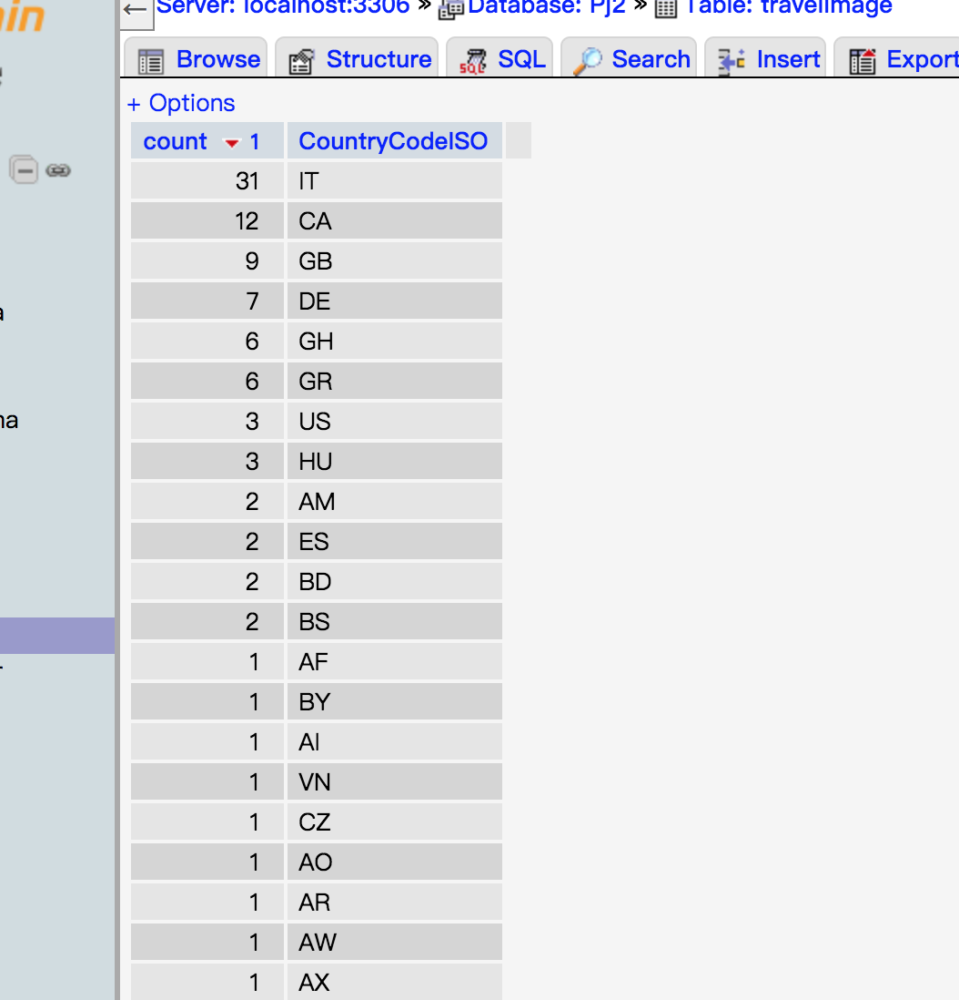

于是在侧边栏中进行以下处理：

```php
 <div id="hot_content">
                    <p><i class="fa fa-fire" aria-hidden="true"></i> HOT CONTENTS</p>
                    <table>
                        <?php

                        $sql="SELECT DISTINCT count( * ) AS count,`Content` FROM travelimage GROUP BY Content ORDER BY count DESC";
                        $result = $con->query($sql);
                        if (mysqli_num_rows($result) > 0) {
                            $i=0;
                            while($row = $result->fetch_row()) {
                                if($row[1]!=null) {
                                    echo '<tr><th><a href="browse.php?hot_content=';
                                    echo $row[1];
                                    echo '" onclick="alert(\'已筛选\')">';
                                    echo $row[1];
                                    echo '</a></th></tr>';
                                    $i++;
                                    if($i==4)
                                        break;
                                }
                            }
                        }

                        ?>
                       </table>
   </div>
<br>

   <div id="hot_country">
                    <p><i class="fa fa-fire" aria-hidden="true"></i> HOT COUNTRYS</p>
                    <table>
                        <?php

                        $sql="SELECT DISTINCT count( * ) AS count,`CountryCodeISO` FROM travelimage GROUP BY CountryCodeISO ORDER BY count DESC";
                        $result = $con->query($sql);
                        if (mysqli_num_rows($result) > 0) {
                            $i=0;
                            while($row = $result->fetch_row()) {
                                if($row[1]!=null) {
                                    $sql="select geocountries.CountryName,geocountries.ISO from geocountries where ISO='$row[1]'";
                                    $res=$con->query($sql);
                                    $country=$res->fetch_row();
                                    echo '<tr><th><a href="browse.php?hot_country=';
                                    echo $row[1];
                                    echo '" onclick="alert(\'已筛选\')">';
                                    echo $country[0];
                                    echo '</a></th></tr>';
                                    $i++;
                                    if($i==4)
                                        break;
                                }
                            }
                        }


                ?>
                    </table>
   </div>
<br>


   <div id="hot_city">
                    <p><i class="fa fa-fire" aria-hidden="true"></i> HOT CITIES</p>
                    <table>
                        <?php

                        $sql="SELECT DISTINCT count( * ) AS count,`CityCode` FROM travelimage GROUP BY CityCode ORDER BY count DESC";
                        $result = $con->query($sql);
                        if (mysqli_num_rows($result) > 0) {
                            $i=0;
                            while($row = $result->fetch_row()) {
                                if($row[1]!=null) {
                                    $sql="select AsciiName from geocities where geonameid='$row[1]'";
                                    $res=$con->query($sql);
                                    $city=$res->fetch_row();
                                    echo '<tr><th><a href="browse.php?hot_city=';
                                    echo $row[1];
                                    echo '" onclick="alert(\'已筛选\')">';
                                    echo $city[0];
                                    echo '</a></th></tr>';
                                    $i++;
                                    if($i==4)
                                        break;
                                }
                            }
                        }


                        ?>
                              </table>
   </div>
</div>
```

然后对应的进行查找。需要注意的是，对于城市和国家的查找都要通过code，所以GET中传的参数也是对应的code。

这里的查找都比较类似就不再贴代码了。

同时这里需要注意的是每一次筛选都会清空之前的筛选条件。所以form的action设置为'',而热门主题国家城市，直接写url加上参数即可。

同时以上的图片都加上了详情页的url，便于跳转。

最后来讲一下分页的实现。这里要求<< 1 2 3 >>这样，左边的icon为上一页，右边的icon为下一页，然后页面数量大于5均截取前五页，之后的分页均与这里的要求相同。

具体实现以此为例子说明，之后涉及到的分页就不多赘述了。

```php
$sql = "select * from travelimage";
$result = $con->query($sql);


$page = empty($_GET['page']) ? 1 : $_GET['page'];
$pageRes = mysqli_fetch_assoc($result);
$count = mysqli_num_rows($result);
//每页显示数 每页显示五条
$num = 20;
//根据每页显示数可以求出来总页数
$pageCount = ceil($count / $num);  //ceil取整
if($pageCount>5)
    $pageCount=5;
//根据总页数求出偏移量
$offset = ($page - 1) * $num; //起始位置


$sql = "select * from travelimage limit $offset,$num";
$result = $con->query($sql);


if (mysqli_num_rows($result) > 0) {

    while ($row = $result->fetch_row()) {
        //while ($row=mysqli_fetch_assoc($res)){

        echo '<a href="./detail.php?path=';
        echo $row[9];

        echo '">';

        echo '';
        echo '</a>';


    }

    echo '<div id="page"> <a href="./browse.php?page=';
    echo ($page-1)>0 ? $page-1:1;
    echo '&browse_search=';
    echo $title;
    echo '" onclick="alert(\'正在跳转前一页\')">&lt&lt&nbsp</a>';
    $i = 1;
    for (; $i <= $pageCount; $i = $i + 1) {
        if ($i == $page) {
            echo '<a style="font-size:40px;color:#00CCCC;"';
        } else {
            echo '<a ';
        }
        echo 'href="./browse.php?page=';
        echo $i;
        echo '&browse_search=';
        echo $title;
        echo '" onclick="alert(\'正在跳转\')"> &nbsp' . $i . ' &nbsp</a> ';
    }
    echo '<a href="./browse.php?page=';
    echo ($page+1)<=$pageCount ? $page+1:$pageCount;
    echo '&browse_search=';
    echo $title;
    echo '" onclick="alert(\'正在跳转后一页\')"> >> </a></div>';
}
```

首先通过我们查询的语句得到了$result，然后通过mysqli_num_rows($result)可以得到总记录数，然后确定每一页需要展示几张图片num，两者相除并通过ceil函数向上取整来得到总页数。然后通过sql语句中的 limit，来得到对应页码的记录数，而每进一页都会在url后增加page的参数，所以如果没有读到page参数，即为第一页，由此获得$page，于是我们的offset就是当前页数-1*num。然后前一页和后一页要控制边界，如果在第一页再往上一页即还应该为第一页，如果为最后一页再往下一页，则还是最后一页。同时通过循环来判断当前为哪一页，然后打印是高亮。

以上browse页完成✅


#### search

将选择何种方式搜索的单选框以GET形式发送到当前页面，然后判断，如果是刚刚加载什么都没有查，打印提示搜索的信息，如果是搜索了没有结果打印no results，然后每次往数据库里查询都判断一下是什么方法，如下显示：

同时这里都支持模糊查询，都是搜索title/description中包含所输入连续字符的记录。

```php
 <?php
   if($_SERVER["REQUEST_METHOD"] != "GET"||($_GET['filter_description']==null&&$_GET['filter_title']==null)){
        echo "<h2>Please input something to search!</h2>";
    }
   else {

       $description = $_GET['filter_description'];
       $title = $_GET['filter_title'];
       $choice = $_GET['choice'];

       if ($choice == "Filter_by_Title") {
           $which = 0;
       } else if ($choice == "Filter_by_Description") {
           $which = 1;
       }

//       if($_GET['which']=0){
//           $which=0;
//       }
//       else if($_GET['which']=0){
//           $which=1;
//       }

       $user = 'root';
       $password = 'root';
       $db = 'Pj2';
       $host = 'localhost';
       $port = 3306;
       $serve = 'localhost:3306';
       $con = new Mysqli($serve, $user, $password, $db);
       $con->query("SET NAMES utf8");//解决中文乱码问题

       if ($which == 0) {
           $sql = "select * from travelimage where title like '%$title%'";
           $result = $con->query($sql);
       } else if ($which == 1) {
           $sql = "select * from travelimage where description like '%$description%'";
           $result = $con->query($sql);
       }


       $page = empty($_GET['page']) ? 1 : $_GET['page'];
       $pageRes = mysqli_fetch_assoc($result);
       $count = mysqli_num_rows($result);
       //每页显示数 每页显示五条
       $num = 5;
       //根据每页显示数可以求出来总页数
       $pageCount = ceil($count / $num);  //ceil取整
       if($pageCount>5)
           $pageCount=5;
       //根据总页数求出偏移量
       $offset = ($page - 1) * $num; //起始位置

       if ($which == 0) {
           $sql = "select * from travelimage where title like '%$title%' limit $offset,$num";
           $result = $con->query($sql);

       } else if ($which == 1) {
           $sql = "select * from travelimage where description like '%$description%' limit $offset,$num";
           $result = $con->query($sql);
       }

       if (mysqli_num_rows($result) > 0) {

           while ($row = $result->fetch_row()) {
               //while ($row=mysqli_fetch_assoc($res)){


               echo '<div class="result1">
';
               echo '<a href="./detail.php?path=';
               echo $row[9];
//               echo '&title=';
//               echo $row[1];
//               echo '&description=';
//               echo $row[2];
//               echo '&country=';
//               echo $row[11];
//               echo '&city=';
//               echo $row[12];
//               echo '&content=';
//               echo $row[10];
//               echo '&author=';
//               echo $row[8];
//               echo '&favorNum=';
//               echo $row[13];
//
//               $sql = "select * from travelimagefavor where username='$username' and path='$row[9]'";
//               $res = $con->query($sql);
//               if (mysqli_num_rows($res) > 0) {
//                   echo '&favored=true';
//
//               }


               echo '">';

               echo '';
               echo '</a>';


               echo '<article class="res_word">';
               echo '<h2>';
               echo $row[1];
               echo '</h2>';

               echo '<p class="resword">';
               echo $row[2];
               echo '</p>';
               echo '</article>';
               echo '</div>';


           }

           echo '<div id="page"> <a href="./search.php?page=';
           echo ($page-1)>0 ? $page-1:1;
           echo '&choice=';
               echo $choice;
               echo '&filter_title=';
               echo $title;
               echo '&filter_description=';
               echo $description;
               echo '" onclick="alert(\'正在跳转前一页\')">&lt&lt&nbsp</a>';
           $i = 1;
           for (; $i <= $pageCount; $i = $i + 1) {
               if ($i == $page) {
                   echo '<a style="font-size:40px;color:#00CCCC;"';
               } else {
                   echo '<a ';
               }
               echo 'href="./search.php?page=';
               echo $i;
               echo '&choice=';
               echo $choice;
               echo '&filter_title=';
               echo $title;
               echo '&filter_description=';
               echo $description;
               echo '" onclick="alert(\'正在跳转\')"> &nbsp' . $i . ' &nbsp</a> ';
           }
           echo '<a href="./search.php?page=';
           echo ($page+1)<=$pageCount ? $page+1:$pageCount;
           echo '&choice=';
           echo $choice;
           echo '&filter_title=';
           echo $title;
           echo '&filter_description=';
           echo $description;
           echo '" onclick="alert(\'正在跳转后一页\')"> >> </a></div>';
       }
       else{
           echo "<h2>No results</h2>";
       }
```


### 2 、用户个人页面

#### 这里都是用户个人界面先将html变成php文件，如果未登录且用url强制访问的话会直接跳转到登录页面，来完成部分界面的访问限制。

如果未设置session则：

```php
<?php else:
    echo 'Please log in first!';
    echo "<script>window.location.href='login.html'</script>";
?>
<?php endif ?>
```

#### upload

首先还是利用bootstapValidator进行合法性校验，所有控件设置required不为空，则只有信息完整的情况下才可以上传图片和信息到数据库。

然后做了upload的修改，这里的主要难点在于上传图片，到数据库中，一开始想的是写二进制blob流到数据库中，但是考虑到整体的数据库的结构，以及大数据后数据库的承载问题，打算新建upfile文件夹，将上传的图片都保存到本地，然后把路径写到数据库的path里。一开始一直报错，经查阅资料后发现form表单中应当添加enctype="multipart/form-data"属性。

之后还有一个问题是，对于重复文件名的照片会覆盖，这里写了一段建立副本的代码，防止不同用户之间传相同文件名的不同文件，或者同一个用户传同一个文件名的不同文件会出错。

**同时如果用户传了与当前本机中文件名相同的会alert提示系统自动重命名为副本。**从而使得路径名唯一，可以从路径名找。同时修改travelimage 将其设置为唯一。

```php
<?php
header("Content-type:text/html;charset-utf-8");
header("Access-Control-Allow-Origin: *"); //解决跨域
header('Access-Control-Allow-Methods:POST');// 响应类型

//$upload="upload";
session_start();
$username=$_SESSION['username'] ;
//$_SESSION['upload'] = $_SESSION['username'];
//echo $_SESSION['username'];
//echo $_SESSION['upload'];

$title=$_POST['upload_pic_title'];
$description=$_POST['upload_pic_description'];
$country=$_POST['upload_pic_country'];
$city=$_POST['upload_pic_city'];
$theme=$_POST['upload_pic_theme'];
$pic=$_FILES['upload_pics'];
$json_arr=array("upload_pic_title"=>$title,"upload_pic_description"=>$description,"upload_pic_country"=>$country,"upload_pic_city"=>$city,"upload_pic_theme"=>$theme);
$json_obj=json_encode($json_arr);
echo $json_obj;
echo "正在跳转，请稍后……";

$user = 'root';
$password = 'root';
$db = 'Pj2';
$host = 'localhost';
$port = 3306;
$serve='localhost:3306';
$con = new Mysqli($serve,$user,$password,$db);
$con->query("SET NAMES utf8");//解决中文乱码问题


$valid=isset($_FILES['upload_pics']);
echo json_encode(array('valid'=>$valid));
$valid=is_uploaded_file($_FILES['upload_pics']['tmp_name']);
echo json_encode(array('valid'=>$valid));

if($username!=null&&$title!=null&&$pic!=null&&$description!=null&&$theme!=null&&$country!=null&&$city!=null) {
    if (isset($_FILES['upload_pics'])
        && is_uploaded_file($_FILES['upload_pics']['tmp_name'])) {
        $imgFile = $_FILES['upload_pics'];
        $upErr = $imgFile['error'];
        if ($upErr == 0) {

            $imgFileName = $imgFile['name'];
            echo $imgFileName;
            $imgSize = $imgFile['size'];
            $imgTmpFile = $imgFile['tmp_name'];

//             将文件从临时文件夹移到上传文件夹中。
//            注意：upfile这个文件夹必须先创建好，不然会报错。

            $sql="select * from travelimage where path='$imgFileName'";
            $result=$con->query($sql);

            $valid = false;
            if(mysqli_num_rows($result)>0)//exists
                $valid=true;


            if (file_exists('../upfile/' . $imgFileName)||$valid) {
                echo "<script language=\"JavaScript\">\r\n";
                echo " alert(\"文件已存在有被覆盖的危险！系统自动将文件名声明为副本\");\r\n";
                // echo " history.back();\r\n";
                echo "</script>";
                $tmp = 1;
                $str = $imgFileName;
                while (file_exists('../upfile/' . $str)) {
                    $tmp++;
                    $str = $tmp . '-' . $imgFileName;
                }
                $imgFileName = $tmp . '-' . $imgFileName;
                echo $imgFileName;
            }

            $valid = move_uploaded_file($imgTmpFile, '../upfile/' . $imgFileName);

            echo json_encode(array('valid' => $valid));

            //判断文件名是否重名


            //显示上传后的文件的信息。
            $strPrompt = sprintf("文件%s上传成功<br>"
                . "文件大小: %s字节<br>"
                . ""
                , $imgFileName, $imgSize, $imgFileName
            );
            echo $strPrompt;

        } else {
            echo "文件上传失败。<br>";
            switch ($upErr) {
                case 1:
                    echo "超过了php.ini中设置的上传文件大小。";
                    break;
                case 2:
                    echo "超过了MAX_FILE_SIZE选项指定的文件大小。";
                    break;
                case 3:
                    echo "文件只有部分被上传。";
                    break;
                case 4:
                    echo "文件未被上传。";
                    break;
                case 5:
                    echo "上传文件大小为0";
                    break;
            }
        }
    } else {
        echo "出错！";
    }

}

$sql="select geocountries.CountryName,geocountries.ISO from geocountries where geocountries.CountryName='$country'";
$result=$con->query($sql);
$row=$result->fetch_row();
$countryCode=$row[1];
$sql="select geocities.AsciiName,geocities.GeoNameID from geocities where geocities.AsciiName='$city'";
$result=$con->query($sql);
$row=$result->fetch_row();
$cityCode=$row[1];
$sql="select * from traveluser where username='$username'";
$result=$con->query($sql);
$row=$result->fetch_row();
$uid=$row[0];

if($username!=null&&$title!=null&&$imgFileName!=null&&$description!=null&&$theme!=null&&$country!=null&&$city!=null) {
    $sentence = "INSERT INTO `travelimage`(`Title`, `Description`,`Content`,`PATH`,`Country`,`City`,`UserName`,`CountryCodeISO`,`CityCode`,`UID`) VALUES ('$title','$description','$theme','$imgFileName','$country','$city','$username','$countryCode','$cityCode','$uid')";

    if (!$con){//如果连接失败
        die('Could not connect: ' . mysqli_error());//输出错误信息并退出脚本
    }
    $res = $con->query($sentence);

    $sql="select * from travelimage where path='$imgFileName'";
    $result=$con->query($sql);
//$data=array();

    $valid = false;
    if(mysqli_num_rows($result)>0)//exists
        $valid=true;

    echo json_encode(array('valid'=>$valid));
    echo $title;
    echo $username;
    echo $imgFileName;
    echo $description;
    echo $theme;
    echo $country;
    echo $city;
}

mysqli_free_result($result);
mysqli_free_result($res);
mysqli_close($con);//关闭mysql链接答

echo " <script   language = 'javascript' type = 'text/javascript' > ";
echo "window.location.href='../html/mypics.php'";
echo " </script > ";


?>
```

增加了【Content】的下拉菜单选择器。

这里的国家城市二级联动实现同browse页。


#### mypics

首先根据是否已经上传了照片，即通过username找到对应的uid然后去找能否在数据库中找到对应的数据，如果可以即已上传，则显示上传图片，如果找不到数据，说明还未上传，显示提示字符。

```php
$sql="select * from traveluser where username='$username'";
$result=$con->query($sql);
$row=$result->fetch_row();
$uid=$row[0];


$sql="select * from travelimage where uid='$uid'";
$result=$con->query($sql);
```

这里动态写入，所以整个设置成了php文件，同时给delete和modify,增加url的参数path为在本机upfile中的路径，modify中添加了详细的信息因为要填充内容。

然后做了delete，通过设置超链接href中的参数，获取路径，在数据库中做了删除操作。但是在本地upfile中没有删除仍留有备份。

#### delete

删除图片，通过path获取imageid，然后删除

```php
$image=$_GET["path"];
echo $image;

$user = 'root';
$password = 'root';
$db = 'Pj2';
$host = 'localhost';
$port = 3306;
$serve='localhost:3306';

$con = new Mysqli($serve,$user,$password,$db);

$sql="select * from travelimage where path='$image'";
$result=$con->query($sql);
$row=$result->fetch_row();
$imageid=$row[0];

$sql="DELETE FROM `travelimage` WHERE `travelimage`.`ImageID` ='$imageid'";
$result=$con->query($sql);
$sql="DELETE FROM `travelimagefavor` WHERE `travelimagefavor`.`ImageID` ='$imageid'";
//照片删除 对应的收藏的也应该删除
$result=$con->query($sql);

mysqli_free_result($result);
mysqli_close($con);//关闭mysql链接答
```


#### modify

网上查阅种种资料表明 ：**因安全问题不允许js对input type=file赋值**

那我没办法了，在modify时将这个不设为必选，即未选择图片时，展示之前的图片，然后通过js，填充通过GET得到的所有信息

```js
function getQueryVariable(variable)
{
    let query = window.location.search.substring(1);
    let vars = query.split("&");
    for (let i=0;i<vars.length;i++) {
        let pair = vars[i].split("=");
        if(pair[0] == variable){return pair[1];}
    }
    return(false);
}

// alert(getQueryVariable('path'));
// alert(getQueryVariable('title'));
// alert(getQueryVariable('description'));
// alert(getQueryVariable('country'));
// alert(getQueryVariable('city'));
//  alert(getQueryVariable('content'));

let mpath=getQueryVariable('path');

let mtitle=getQueryVariable('title');
let mdescription=getQueryVariable('description');
let mcontent=getQueryVariable('content');

if(mpath!=false&&mtitle!=false&&mdescription!=false&&mcontent!=false)
    modify();


//let filepath='../upfile/'+path;
//let file = new File(,)
function modify() {
    let up_button=document.getElementById("up_button");
    let title=document.getElementsByName('upload_pic_title');
    let description=document.getElementsByName('upload_pic_description');
    let country=document.getElementById('first');
    let city=document.getElementById('second');
    let content=document.getElementsByName('upload_pic_theme')[0];

    document.getElementById("up_line").style.display = "none";
    let image = document.getElementById('ready_to_up_pics');
    image.setAttribute('src', '../upfile/' + mpath);
    up_button.required = false; //设置选择文件不一定要选
    title[0].value = decodeURI(mtitle);
    //encodeURI(title[0].value);

    description[0].value = decodeURI(mdescription); //decode
    //encodeURI(description[0].value);

    switch (mcontent) {
        case 'Building':
            content.options[1].selected = true;
            break;
        case 'Wonder':
            content.options[2].selected = true;
            break;
        case 'Scenery':
            content.options[3].selected = true;
            break;
        case 'City':
            content.options[4].selected = true;
            break;
        case 'People':
            content.options[5].selected = true;
            break;
        case 'Animal':
            content.options[6].selected = true;
            break;
        case 'Other':
            content.options[7].selected = true;
            break;
    }

    let submit=document.getElementById('upload_submit');
    submit.innerHTML='Modify';
    let page=document.getElementsByClassName('up_til')[0];
    page.innerHTML='MODIFY';
    let form=document.getElementsByTagName('form')[0];
    form.setAttribute('action','../php/modify.php?path='+mpath);
    }
```

同时这里有一个中文乱码问题。一开始觉得很疑惑，数据库存的中文写到url中显示确实是中文


但是我通过函数获取了参数之后就是中文乱码了。

查阅资料后显示：

“由于我们利用URL传递参数这种方式是依赖与浏览器环境中的，也就是说URL及URL中包含的各个key=value格式的传递参数键值对参数是在浏览器地址栏中的处理原理处理相应编码后传递至后台进行解码的。 由于我们没有进行任何处理，此时javascript请求URL并传参数存在中文时（也就是说输入框中输入中文时），对URL的中文参数进行编码是按照浏览器机制进行编码的。此时编码存在乱码问题。

利用encodeURI()在javascript中对中文URL参数进行编码时，“测试”二字会被转换为“%E6%B5%8B%E8%AF%95”。 但是问题依然存在。原因是在编码后的字符串信息，浏览器机制会认为“%”是一个转义字符，浏览器会把地址栏URL中的传递的已转换参数“%”与“%”之间的已转义字符进行处理传递到后台中。这样会造成与实际经过encodeURI()编码后的URL不符，因为浏览器误认为“%”是转义字符字符了，它并未将“%”认为是个普通字符。”

即我在地址这行看到的是浏览器转义之后的结果，但是赋值给输入框浏览器会直接赋值，所以这里在赋值的时候

```js
title[0].value = decodeURI(mtitle);
```

即可，能看到显示为正常的中文。

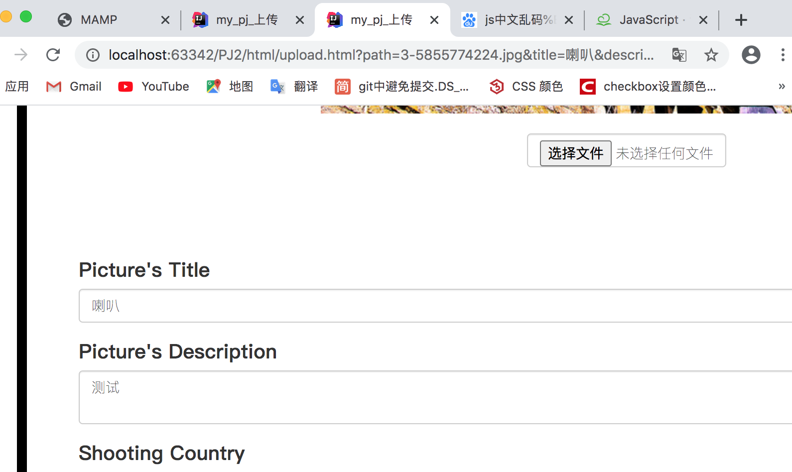


这里的有个难点在于填充内容时的二级联动。放在了upload.php中实现，先在国家中找到与传来的countrycode对应的国家名相同的选项，设为被选中，然后像之前的二级联动一样添加对应的cities，最后遍历cities然后找到与传来的citycode对应的城市名相同的选项设为被选中。

```php
<script defer>
   <?php
            if($_GET['cityCode']!=''&&$_GET['countryCode']!='')
            {
                $cityCode=$_GET['cityCode'];
                $countryCode=$_GET['countryCode'];

                $sql="select geocountries.CountryName from geocountries where ISO='$countryCode'";
                $result=$con->query($sql);
                $row=$result->fetch_row();
                $country=$row[0];

                $sql="SELECT * FROM geocities WHERE `GeoNameID`='$cityCode'";
                $result=$con->query($sql);
                $row=$result->fetch_row();
                $city=$row[1];

                $sql="SELECT * FROM geocities where `CountryCodeISO`='$countryCode'";
                $result=$con->query($sql);

            }

    ?>

    let country=document.getElementById('first');
    let city=document.getElementById('second');

    for(let i=0;i< <?php echo $count; ?>;i++) {
       if(country.options[i].value=='<?php echo $country; ?>') {
           country.options[i].selected = true;
           break;
       }

    }
   city.options.length = 1; // 清除second下拉框的所有内容

   $.getJSON("../php/findRelatedCity.php",{first:$("#first").val()},function(json){

       $.each(json,function(index,array){

           //var option = "<option value='"+array['id']+"'>"+array['title']+"</option>";
           city.options.add(new Option(array['city'], array['city']));
       });


       for(let i=0;i<city.options.length;i++) {
           if(city.options[i].innerText=='<?php echo $city; ?>') {
               city.options[i].selected = true;
               break;
           }

       }
   });


</script>
```


之后正常的设置更新，如果input type=file，不为null，说明修改了图片，像upload一样将上传的暂存的图片保存到本地，但是重写到同样的path，因为是修改。

同时因为这里通过url的参数，要防止一个用户复制path，来修改别的用户的图片，所以加上了验证当前session对应用户名的uid与图片本身的uid是否相同，如果相同则update修改，如果不同则忽略。

这里发现了一件非常非常诡异的事情，我的upload一会儿可以加到数据库中一会儿数据库中没有显示也查询不到，一会儿数据库中没有显示，可以查询到……询问助教后也得不到答案，怀疑是数据库的问题，因为相同的sql语句复制到网页中运行是可以成功的，而且之前都没有出现这种情况。

好的，经过我四个多小时缜密的测试和探查，惊奇的发现是因为我设置了path为唯一，但是助教提供的原始数据与我本地travel-image图片集的文件名相同……所以insert就会出错orz，修改upload中某重命名的函数如下即可：

```php
$sql="select * from travelimage where path='$imgFileName'";
            $result=$con->query($sql);

            $valid = false;
            if(mysqli_num_rows($result)>0)//exists
                $valid=true;
if (file_exists('../upfile/' . $imgFileName)||$valid) {
    echo "<script language=\"JavaScript\">\r\n";
    echo " alert(\"文件已存在有被覆盖的危险！系统自动将文件名声明为副本\");\r\n";
    // echo " history.back();\r\n";
    echo "</script>";
    $tmp = 1;
    $str = $imgFileName;
    while (file_exists('../upfile/' . $str)) {
        $tmp++;
        $str = $tmp . '-' . $imgFileName;
    }
    $imgFileName = $tmp . '-' . $imgFileName;
    echo $imgFileName;
}
```

这样与数据库中重名，但是本地upfile没有的文件，就会命名为1-***。同时把travelimage中的图片复制到upfile。


#### myfavor

在数据库中对travelimage增加FavoredNum记录图片被收藏数，且更新过，在travelimagefavor中增加了UserName和Path，这些在相应的表中都是唯一的。

然后做了myfavor页面，基本同mypic的逻辑，只是先从travelimagefavor中找到是否有此用户收藏的图片，如果找不到输出提示文字，如果找到了，先进行分页操作，然后逐个访问，访问时再从travelimage中利用imageid找到对应的图片，然后基本同mypic一样的操作，进行填充。

```php
    $username=$_SESSION['username'];
    $user = 'root';
    $password = 'root';
    $db = 'Pj2';
    $host = 'localhost';
    $port = 3306;
    $serve='localhost:3306';


    $con = new Mysqli($serve,$user,$password,$db);

    $sql="select * from traveluser where username='$username'";
    $result=$con->query($sql);
    $row=$result->fetch_row();
    $uid=$row[0];

    $sql="select * from travelimagefavor where uid='$uid'";
    $result=$con->query($sql);
//
//    if(!mysqli_num_rows($result)){
//
//        $sql="select * from travelimagefavor where username='$username'";
//        $result=$con->query($sql);
//    }

    $page =empty($_GET['page']) ? 1:$_GET['page'];
    $pageRes = mysqli_fetch_assoc($result);
    $count = mysqli_num_rows($result);
    //每页显示数 每页显示五条
    $num = 5;
    //根据每页显示数可以求出来总页数
    $pageCount = ceil($count/$num);  //ceil取整
    if($pageCount>5)
        $pageCount=5;
    //根据总页数求出偏移量
    $offset = ($page-1)*$num; //起始位置
    $sql="select * from travelimagefavor where uid='$uid' limit $offset,$num";
    $res=$con->query($sql);
//    if(!mysqli_num_rows($res)){
//
//        $sql="select * from travelimagefavor where username='$username' limit $offset,$num";
//        $res=$con->query($sql);
//    }

    if(mysqli_num_rows($res)>0)
    {

        while($rowfavor=$res->fetch_row()){
            //while ($row=mysqli_fetch_assoc($res)){

            $sql="select * from travelimage where imageid=$rowfavor[3]";
            $result=$con->query($sql);


            $row=$result->fetch_row();

            echo '<div class="favoreach">
';
            echo '<a href="./detail.php?path=';
            echo $row[9];

            echo '">';
            echo '';
            echo '</a>';


            echo '<article class="pic_word">';
            echo '<h2>';
            echo $row[1];
            echo '</h2>';

            echo '<p class="picword">';
            echo $row[2];
            echo '</p>';
            echo '</article>';
            echo '<div class="con_word">
                    <div class="size2">DON\'T LIKE <a class="like" ';
            echo 'name="';
            echo $row[9];
            echo '" href="../php/myfavorCancelFavored.php?path=';
            echo $row[9];
            echo '&username=';
            echo $username;
            echo '" onclick="alert(\'取消收藏\')">';
            echo '<i class="fa fa-heart" aria-hidden="true"></i></a></div>
                    </div></div>';
            }

            echo '<div id="page"> <a href="./myfavor.php?page=';
            echo ($page-1)>0 ? $page-1:1;
            echo '" onclick="alert(\'正在跳转前一页\')">&lt&lt&nbsp</a>';
            $i=1;
            for(;$i<=$pageCount;$i=$i+1){
                if($i==$page){
                    echo '<a style="font-size:40px;color:#00CCCC;"';
                }
                else{
                    echo '<a ';
                }
                echo 'href="./myfavor.php?page=';
                echo $i;
                echo '" onclick="alert(\'正在跳转\')"> &nbsp'.$i.' &nbsp</a> ';
            }
            echo '<a href="./myfavor.php?page=';
        echo ($page+1)<=$pageCount ? $page+1:$pageCount;
        echo '" onclick="alert(\'正在跳转后一页\')"> >> </a></div>';


    }
    else{
        echo "<div id=\"pic_line\">You haven't favored any pictures!
                <br>
                Please create sth!!</div>";
    }


    mysqli_free_result($result);
    mysqli_close($con);


    ?>
  
```

然后这里的删除收藏基本同detail，不再赘述。

## √ Bonus

#### 1、在数据库中存储用户名密码时，采用哈希加盐

经查找资料后发现了php有两个针对哈希加盐和判断的方法，且比简单的md5（）加盐更安全，即单项哈希加盐值，这种加密是不可逆的。
php已经提供了相关函数password_hash 和password_verify。

**password_hash()** 使用足够强度的单向散列算法创建密码的散列（hash）。这里我使用了**`PASSWORD_DEFAULT`** - 使用 bcrypt 算法 (PHP 5.5.0 默认)。

**password_verify()** 函数用于验证密码是否和散列值匹配。

如果密码和散列值匹配则返回 TRUE，否则返回 FALSE 

同时与传统的md5（）的加密不同，经实验发现同样的密码通过**password_hash()** 产生的hash不同，即不能像md5（）一样直接匹配是否相同，而还是应该采用verify方法。

以上了解了基本原理和方法，来修改一下我们的login和register以及验证密码的php文件如下：

register：

```php
$pass=password_hash($passwordRegister, PASSWORD_DEFAULT);
$sql="INSERT INTO `traveluser`(`UserName`, `Email`,`Pass`) VALUES ('$username','$email','$pass')";
if($username!=null&&$email!=null&&$passwordRegister!=null)
$result=$con->query($sql);
```

passwordCheck:

```php
$passwordRegistered=$_POST['password'];
$sql="select pass from traveluser where username='$_POST[id]'";
$result=$con->query($sql);
//$data=array();
$row=$result->fetch_row();
$valid = false;
if(mysqli_num_rows($result)>0)//exists
{
    if(password_verify($passwordRegistered,$row[0]))
    $valid = true;
}

echo json_encode(array('valid'=>$valid));

mysqli_free_result($result);
mysqli_close($con);//关闭mysql链接答
```

Login:

```php
$passwordRegistered=$_POST['password'];
$sql="select pass from traveluser where username='$_POST[id]'";
$result=$con->query($sql);
//$data=array();
$row=$result->fetch_row();
$valid = false;
if(mysqli_num_rows($result)>0)//exists
{
    if(password_verify($passwordRegistered,$row[0]))
        $valid = true;
}

mysqli_free_result($result);
mysqli_close($con);//关闭mysql链接答
if($valid) {
    $_SESSION['username'] = $username;
}
```

同时要把助教给的原有数据一起加密，助教的密码都是abcd1234，这里写了个php文件updatePasswordToSalted来一次性更新。

```php
<?php
$username=$_POST['id'];
$pwd=$_POST['password'];
$user = 'root';
$password = 'root';
$db = 'Pj2';
$host = 'localhost';
$port = 3306;
$serve='localhost:3306';
$con = new Mysqli($serve,$user,$password,$db);

$i=1;
for(;$i<36;$i++) {
    $sql = "select pass from traveluser where uid='$i'";
    $result = $con->query($sql);

    if (mysqli_num_rows($result) > 0) {
        $row=$result->fetch_row();
        $passwordRegister=$row[0];
        $pass=password_hash($passwordRegister, PASSWORD_DEFAULT);
        $sql = "update traveluser set pass='$pass' where uid='$i'";
        $result = $con->query($sql);
    }


}

?>
```

成功！数据库里如下：

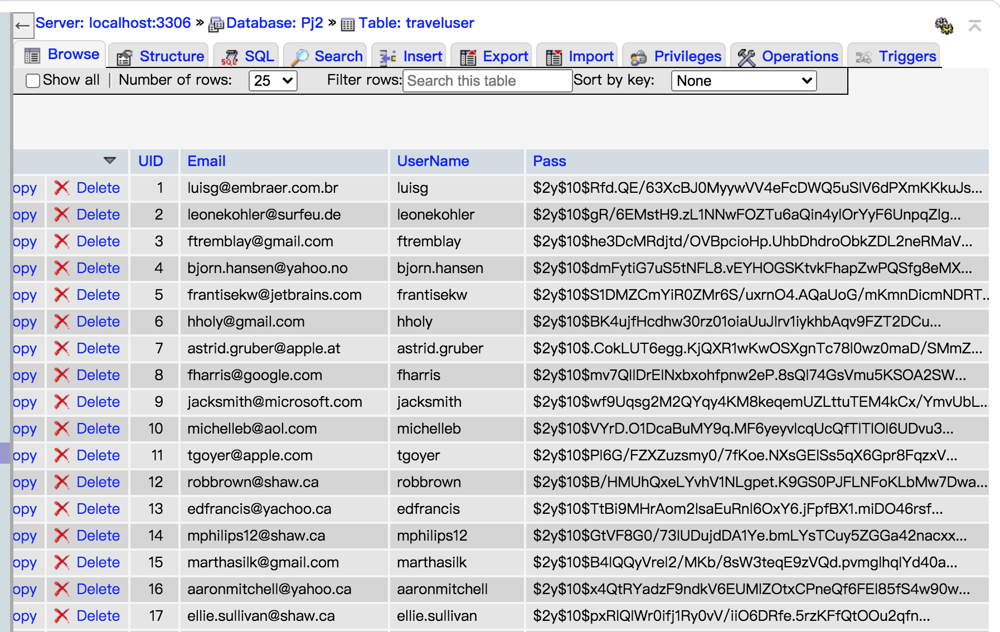


#### 2、远程主机部署并域名展示

最终部署好的成果，域名⬇️（花了我整整两天熬到半夜orzzzzz）

http://mikollin.xyz:63888/SOFT130002_pj2/index.php

首先根据助教之前发的服务器指南去阿里云领主机。


然后去腾讯云注册域名并且实名认证，通过后要把我的主机与我的域名绑定起来。即进入域名解析列表，快速添加网站，填入阿里云获得的主机名，就绑定好了。

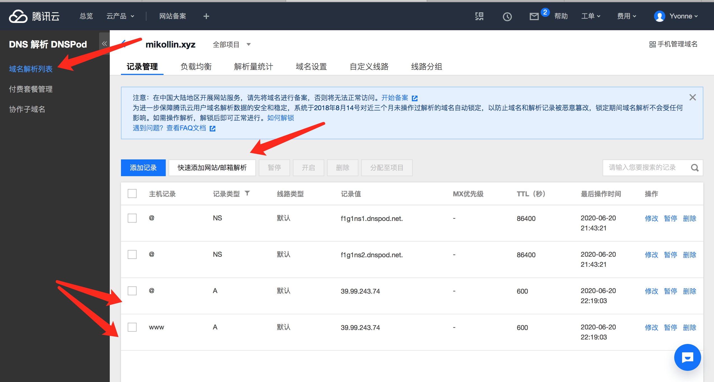

可以看到成功了：

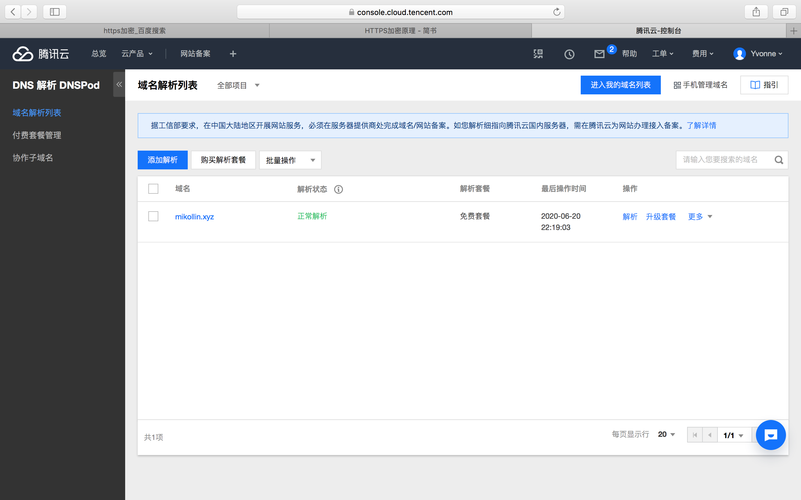

然后我先通过filezilla把我的pj的文件传到了远程主机相应web的根目录/var/www/html里。

这里有个问题该怎么远程访问主机呢？通过终端命令行有点不方便，而且很不稳定老是闪退。。。

然后发现可以通过阿里云的管理平台直接远程登录，但是登陆之前我们先要来设置一下安全组。

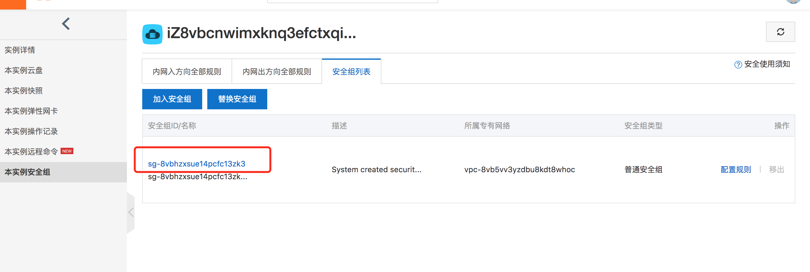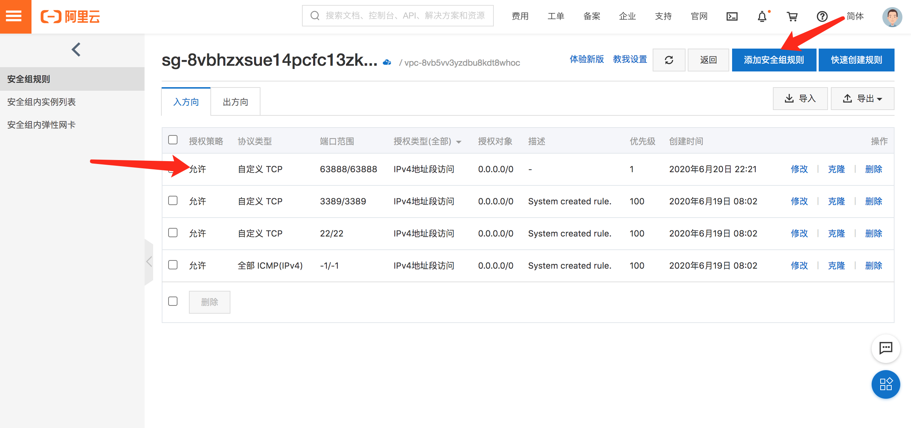

然后远程登录：

先点击远程连接，然后填写下表

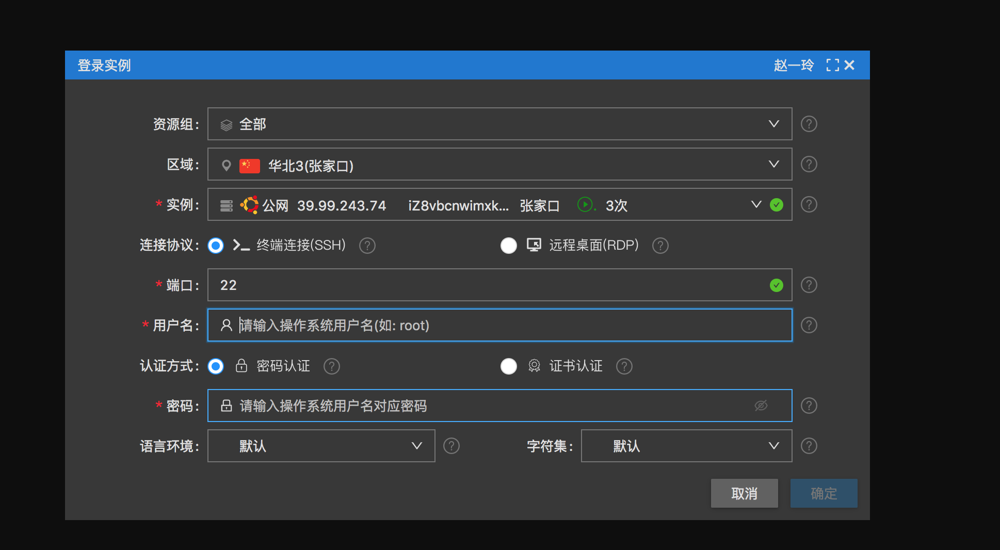

之后看到的就是终端形式（这个比较稳定，而且还有可视化的文件树，这里一开始尝试了安装图形化桌面，但是好像没什么用。。。）

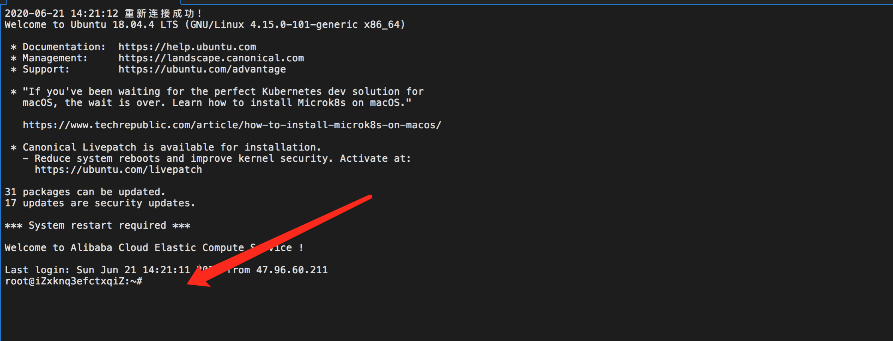

然后要通过命令行下载apache和mysql和php，并且进行配置。。。

这里实在是太花时间了，遇到了各种各样的问题。基本简单总结一下并梳理一下大致过程：

```
sudo apt-get install apache2
```

```
sudo apt-get install php7.0
```

```
sudo apt-get install mysql-server mysql-client 
```

这里的按照网上的博客都没什么问题，但是以下两个php与apache和mysql连接的插件和扩展老是说我没有找到package

```
sudo apt-get install libapache2-mod-php7.0
sudo apt-get install php7.0-mysql
```

网上搜索了一番发现：

```
sudo apt-get update
sudo apt-get install apache2 php7.0 php7.0-mysql mysql-server
```

似乎可以成功了，还是要更新一下。

之后打开mysql和apache：这里给出基本操作

```
 Linux系统为Ubuntu

一、Start Apache 2 Server /启动apache服务
# /etc/init.d/apache2 start
or
$ sudo /etc/init.d/apache2 start
二、 Restart Apache 2 Server /重启apache服务
# /etc/init.d/apache2 restart
or
$ sudo /etc/init.d/apache2 restart
三、Stop Apache 2 Server /停止apache服务
# /etc/init.d/apache2 stop
or
$ sudo /etc/init.d/apache2 stop
```

```
启动mysql： 
方式一：sudo /etc/init.d/mysql start  
方式二：sudo service mysql start 停止mysql： 
方式一：sudo /etc/init.d/mysql stop  
方式二：sudo service mysql stop 
重启mysql： 
方式一：sudo/etc/init.d/mysql restart 
方式二：sudo service mysql restart
```

然后通过主机名/域名可以看到Apache的欢迎网站，然后试着写一个phpinfo（）也能成功了。

然后通过

```
mysql -uroot -p
```

进入mysql并且通过create建表，use切换表，source导入表，均成功。

一开始以为这样就可以完成了，打开了页面发现无法连接数据库。但是我的mysql已经确定打开，可以看到状态为running，同时也可以通过命令行进入mysql，看到对应的信息，不知道为什么不行。

在这里焦灼了很长时间，尝试了各种办法，一开始打算，换方法，用mamp连接，但是似乎mamp的虚拟主机连接的配置问题搞了很久，一直出错还是没法显示，尝试了各种办法还是不行。

第二天发现是因为上面有个包libapache2-mod-auth-mysql没装，导致php和mysql无法连接。

但是安装过程中总是报错如下：Unable to locate package libapache2-mod-auth-mysql

更新update了也不行，之后发现是我们php.ini需要更改一样东西，由于使用了php7，而php7不支持连接mysql了应该用mysqli。

解决方法如下:
locate php.ini
找到php.ini文件并且编辑此文件, 找到 ;extension=php_mysqli.dll 这一行去掉前面的 ; 然后保存此文件。可以看到安装成功！简单的测试文件中显示数据库连接成功。但是手动增加表中的列太麻烦了，已经6/21号了ddl迫在眉睫！！

本来想安装本地用的mamp，但是查不到命令行的安装，同时本地传过去太耗时间了，也不知道能不能运行。之后发现阿里云的远程机本来就支持phpmyadmin！

于是采用如下方法：安装phpmyadmin-Mysql数据库管理

sudo apt-get install phpmyadmin

phpmyadmin设置：

在安装过程中会要求选择Web server：apache2或lighttpd，使用空格键选定apache2，按tab键然后确定。然后会要求输入设置的Mysql数据库密码连接密码。

然后将phpmyadmin与apache2建立连接，根目录为/var/www/html，phpmyadmin在/usr/share /phpmyadmin目录，所以就用命令：

sudo ln -s /usr/share/phpmyadmin /var/www/html 建立软连接

phpmyadmin测试：在浏览器地址栏中打开：http://mikollin.xyz:63888/phpmyadmin

然后发现还有错？？

首先报错，无法看到登录的界面：

```
The mbstring extension is missing. Please check your PHP configuration.
```

发现是需要打开php的扩展：；extension=php_mbstring.dll，去掉前面的分号即可

然后发现之前设置的root和密码无法登陆？？太诡异了！！！一度非常想放弃！但是！！

发现还是重新创建一个新的用户更方便，更改root密码非常繁琐，而且改了之后好像也没什么效果。

#### 查阅资料发现：

mysql5.7版本，默认root禁止通过phpmyadmin使用密码登录的。

所以，新装完MySQL和phpmyadmin以后，如果使用root登录，会出现以下提示信息：

| 1    | 无法登录 MySQL 服务器                                        |
| ---- | ------------------------------------------------------------ |
| 2    | mysqli_real_connect(): (HY000/1698): Access denied for user 'root'@'localhost' |

最近简单的解决方法就是在服务器命令行下直接操作新增一个完全权限的账户：

| 1    | GRANT ALL PRIVILEGES ON *.* TO '用户名'@'localhost' IDENTIFIED BY '密码' WITH GRANT OPTION; |
| ---- | ------------------------------------------------------------ |
|      |                                                              |

然后通过新用户登录phpadmin！成功！

但是发现远程主机与本地相比有好多问题，一个是我的注册如果用了hash加盐，密码就会自动变成空字符串的加密？？？导致login 无法匹配，只能在远程主机上把这步去掉，但是在本地都是一切正常的。

还有最重要的一点是：在upload时发现图片无法显示最终发现：

由于Linux系统的安全性原则，改目录下的文件读写权限是只允许root用户操作的，所以我们不能在www/html文件夹中新建php文件，也不能修改和删除，即我们不拥有写/var/www/html/upfile的权限，必须要先修改读写权限。

`sudo chmod 777 /var/www/html/upfile`

最终再经过各种调试终于成功了orz

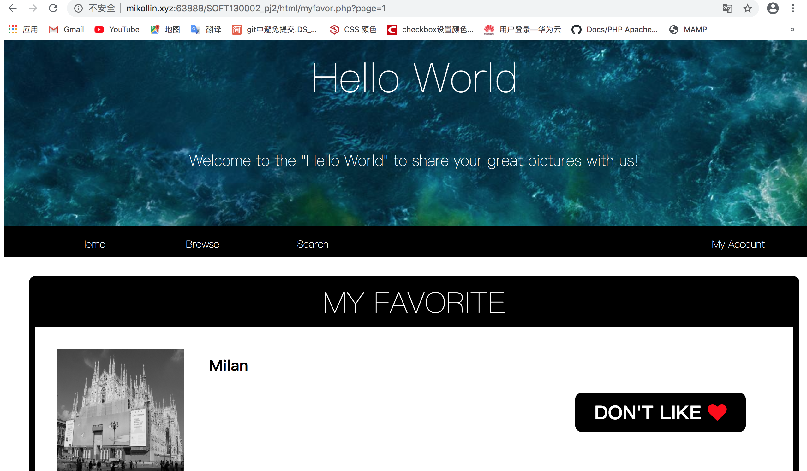


最后还可以把phpstorm与远程主机连接起来方便修改和调试：

服务器与PHPStorm的配合使用
如果说只用服务器来开发，这不会是一个好的主意，而且是一个很危险、很浪费时间的注意。接下来，我们使用IDE配合服务器来使用，拒绝项目用U盘和网盘拷来拷去，只要有网络，任何地方都可以看见我的项目。
1、Tools->Deployment->Configuration
2、按+添加一个Server，Name任意，Type选择SFTP，
3、Connection里面需要填写SFTP host，它是你的公网IP地址，Root path选择/var/www/html它是你的项目地址，如果你设置了其它地址，请修改该项，User name 、Password分别是你的服务器的用户名和密码。
4、Mappings需要填写Deployment path on server '本地项目名' 为/，只要点后面的文件夹即可。
5、如果想要调试的时候用服务器来调试，那么请选择Use this server as default，如果没有选择，那么会用你之前配置的服务器来调试，没有配置则用PHPStorm内置服务器调试（这也就是为什么调试的时候地址栏后面会有一大串的字符的原因）
6、如果想每次保存都上传到服务器中的画，请勾选Tools->Deployment->Atuomatic upload(alway)
7、可以通过Tools->Deployment下的Upload和Download上传和下载项目。
（以上的原文链接：https://blog.csdn.net/qq_33172274/article/details/83721596 ）